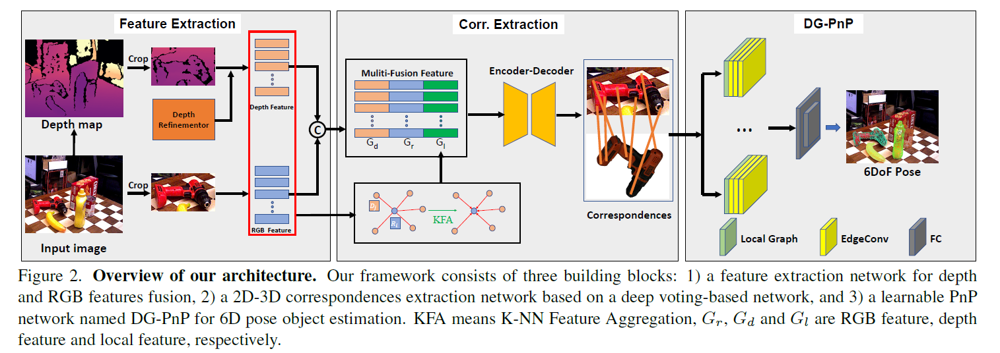
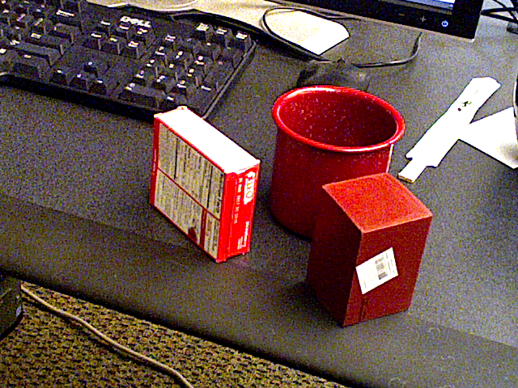

# DGECN
This repo provides the PyTorch implementation of the work:

**Tuo Cao, Fei Luo, Yanping Fu, Wenxiao Zhang, Shengjie Zheng, Chunxia Xiao. DGECN: A Depth-Guided Edge Convolutional Network for End-to-End 6D Pose Estimation. In CVPR 2022.** [Project page](http://graphvision.whu.edu.cn/)

Please note that this repo only contains test code without KFA and DRN, and test with RANSAC/PnP. But we also provide our DG-PnP, we may provide the full code in [Huawei Ascend](https://gitee.com/ascend/ModelZoo-PyTorch/tree/master/PyTorch/contrib/cv) after the conference.

## Overview
<p align="center">

<p>


## Requirements
* Ubuntu 16.04/18.04, CUDA 10.1/10.2, python >= 3.6, PyTorch >= 1.6, torchvision
* Generate your test file list as ycb-video-testlist.txt


## Datasets and Pretrained model
Download the YCB-V from [here](https://rse-lab.cs.washington.edu/projects/posecnn/) and extract to ./data.

Please also download the pretrained model from here ([BaiduNetDisk](https://pan.baidu.com/s/1q6ar8b-zXzX_Dn4jEIjugA), [OneDrive](https://1drv.ms/u/s!AiHxSa8u7WVsaRnkDzRcQZPnAi4?e=uVm0wF), password: gk8y).


## Evaluation on YCB-V
`python test.py --use_gpu --filelist=FILELIST --out_dir=./Result --test_mode=YCB-Video --model_path=MODEL_PATH`

Example:
```
python test.py --use_gpu --filelist=ycb-video-testlist.txt --out_dir=./Result --test_mode=YCB-Video --model_path=dgecn.pth
```


## Visualize depth predictions

```
python depth_vis.py --image_path=IMAGE_PATH --model_path=MODEL_PATH --ext==FILE_EXT
```

Example:

```
python depth_vis.py --image_path=./assert/test_0.png --model_path=dgecn.pth --ext=png
```

This pretrained model is trained on  video 0000 ~ 0010， the predictions on other videos may not good. We will release our pretrained model on all videos in the full code.
  
<p align="center">
     
</p>

## Citation

If you find this useful in your research, please consider citing our paper.

# References
* [\[1\]](#references) Sida Peng, Yuan Liu, Qixing Huang, Hujun Bao, and Xiaowei Zhou. **PVNET: Pixel-wise voting network for 6dof pose estimation**.
* [\[2\]](#references) Yinlin Hu, Joachim Hugonot, Pascal Fua, and Mathieu Salz- mann. **Segmentation-Driven 6D Object Pose Estimation.**.
* [\[3\]](#references) Clément Godard, Oisin Mac Aodha, Michael Firman and Gabriel J. Brostow. **Digging into Self-Supervised Monocular Depth Prediction**.
* [\[4\]](#references) Wang, Yue; Sun, Yongbin; Liu, Ziwei; Sarma, Sanjay E.; Bronstein, Michael M.; Solomon, Justin M. **Dynamic Graph CNN for Learning on Point Clouds**.
* [\[4\]](#references) Gu Wang, Fabian Manhardt, Federico Tombari, and Xi- angyang Ji. **GDR-net: Geometry-guided direct regression network for monocular 6d object pose estimation**.
